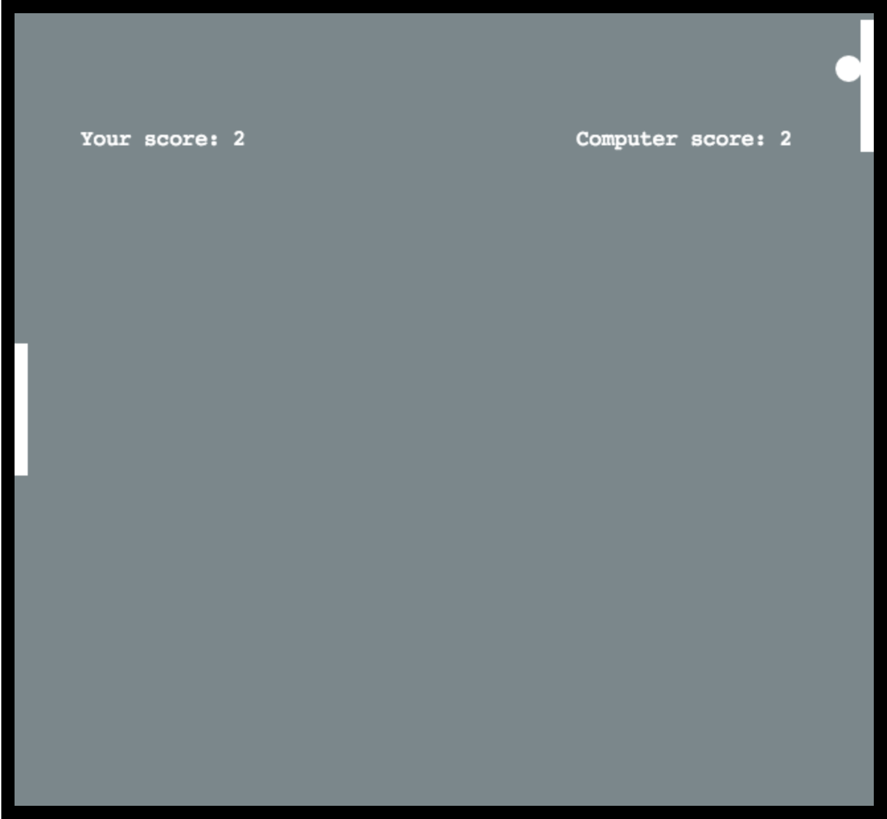
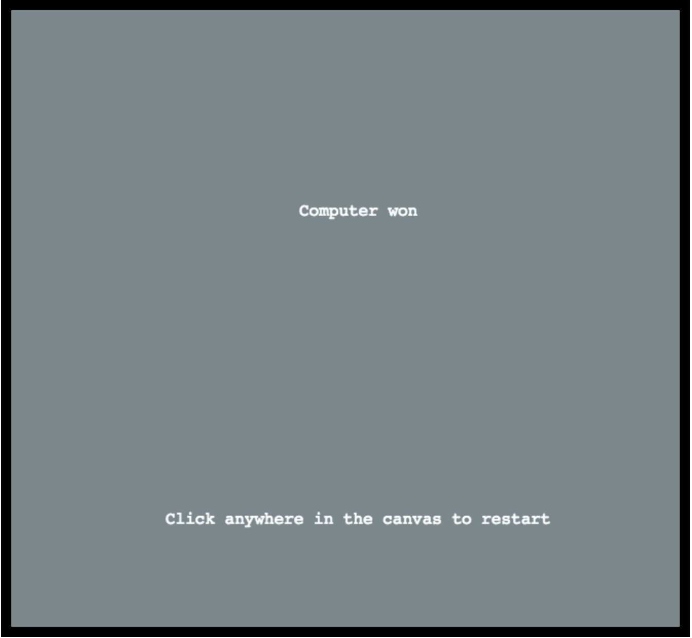

# Ping-Pong-Arcade-Game
HTML5 canvas game with AI for computer paddle. 

## Prerequisites
Yarn or npm

## Getting Started
Download the files, run npm or yarn install, it will install the dependencies. Once dependencies are installed run gulp watch to start browserify,
you can then make changes to files in src and see the compiled code in dist files

## Screenshots
 

## How to play?
When you load the page, game automatically starts, mouse the move up or down or keyboard up or down buttons to move the paddle, 
be mindful that pointer has to be within the game container for the mouse move to work. The right paddle(computer) moves by itself.
First palyer to score 5 points will win the game.

## Built With
  - [Gulp.js](https://gulpjs.com/) - The task manager
  - [Yarn](https://yarnpkg.com/en/) - The package manager
  - [Webpack](https://webpack.js.org/) - The module bundler
  - [Babel](https://webpack.js.org/) - The compiler to write latest JavaScript
